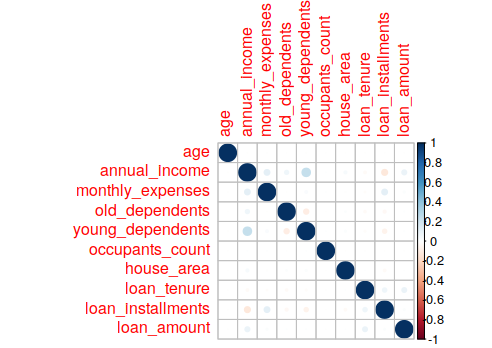

# Descriptive Analysis of Variables  

## Problem Description 

We are given data about many people indicating their personal details, financial details etc.

*  We have to come up with a model to predict the loan amount for each person. 
* We also have to build a model to predict the maximum loan amount for each customer. 
* Check what all are significant predictors and comment.  

## My Approach 

* We start with a detailed look at all the features at hand and see if we can do some feature elimination or extraction.  

* Since we are dealing with a continuous problem as prediction we have to fit some form of regression model on the data. 

* I will start with some basic models and see how the performance improves by using more complex algorithms. 

* To predict the maximum loan amount that can be granted to a customer, there are two ways to go about it in my opinion. There is no maximum loan amount provided in the data set. So, the uncertainty in prediction can be utilised by looking at confidence limits for each prediction. These are straightforward to get for linear regression, but some effort needs to be done if we want to predict confidence intervals for lets say a random forest. We will see how far we are able to go in this direction. 

* Another neat approach which might work comes from this thought. Similar customers behave similarly. That is given a customer, look at *similar* customers and check what was the loan amount given to them. And based an that decide what maximum loan amount can be given. To do this first partition the data set into clusters and check if we get a good separation between clusters. Or pose it as a classification problem depending on the loan amount. Let us say we partition the data into three categories (low, medium and high loan amount based on some threshold) and get a *good* accuracy by running a classification algorithm. Then for a new customer we can simply classify it into a category and take the mean (*or max!*) of the loan amount from all the customers in that category as the maximum loan amount that can be granted. 

    

## Data Inspection 

The first step in any problem involving data is to load the data and have a look at it closely. Just a visual inspection can sometimes save you a lot of time. There are 40,000 rows and 21 columns in the training data we have. Let us drop some columns in the beginning which I feel might not be a *significant* predictor for loan amount. 

* The **Id** column is just a numeric id of the person. And it is highly unlikely that it would affect the loan amount approved for that person. 

* The **city** column has a lot of values missing. Also there are almost 858 unique cities. A better categorical variable for position could have been east, west, north or south depending on the location of the city. It will be difficult to gain any useful insight from the 858 levels of cities and since no more geographical details are given, I decide to drop the city column. Here I am assuming that the approval of loan depends more on the social status of the person than the geographic location. 

## Missing values and imputation 

The columns with missing values are - 

|   Column Name    | Percent of missing values |
| :--------------: | :-----------------------: |
|   social_class   |           0.005           |
| primary_business |           0.065           |
| monthly_expenses |            0.3            |
|                  |                           |

Fortunately not a lot of data is missing. We will fix it later when looking at each feature in detail. 

## Feature Engineering 

This is a regression problem since we will try to predict the loan amount. It is good to check if some of our features are multicollinear or not. For this we have a look at the pair correlation values for all the numeric features. 

<figure>

<figcaption>
Fig 1: Pairwise correlation between features
 </figcaption></figure>

We can see here that there is no high correlation between any numeric features. It is safe to assume that our features don't have multicollinearity. 

Let us have a look at each feature separately. We fix the numerical variables first. 

## Treatment of numeric variables 

### Age 

A numeric summary of age shows us that the minimum value ins 2.0 while the maximum value is 766105. These can be false values. Further inspection shows us that there are ages of above 200 as well. We take a threshold value of 100 and assume that no one in our data is more than 100 years old. Another thing is that all ages are in whole numbers so we take the median to replace the false values. Also, the distribution of age seems like it is right skewed by looking at the boxplot and histogram. Which makes sense because majority of loan seekers were from the age group between 20 and 40 years, while there also people above 60 years seeking for a loan. 

### Annual Income 

There are a lot of rows where the annual income is zero. It is highly unlikely that a loan would have been approved in such a case and it seems like an error. To fix this we impute all these values with the median of income, to make it robust to outliers. Income data is also right skewed so majority of data we have are customers with *lower income*. 

### Monthly Expenses 

First we impute the missing values in the data as the mean of monthly expenses. Then we see that there a lot of monthly expenses in single digits, which does not seem likely. We therefore replace these values with the mean as well. This data also has a lot outliers since monthly expenses can vary greatly between different households. 

The columns <code>old_dependents</code> and <code>young_dependents</code> seem fine. They don't have any missing data as well as any abnormal values. 

### Occupants Count 

There are 14 rows where occupant count is more than 20. This seems highly unlikely and we replace these values with the median. Also there were some houses where occupant count is zero. For such cases as well we impute it as the median. Most of the occupant count is between two to four. 

### House Area 

There many place in which the house area is 0. And also many places where house area is 1. This seems like an error. We replace these values with the mean. Also more information needs to be gathered for this data as units are not clear and some house areas as as big as 700000 and some as small as 2. There are a large number of houses with house area greater than 10000. Something is off about the scale.  

**<code>loan_tenure</code>**  seems all right, with minimum value of tenure being 3 months and going up to 84 months. Majority of loans are of 12 months. (assuming the unit is months!)

### Loan Instalments 

Some loan instalments are zero which seems unlikely. We replace these values with the median. 

### Loan Amount (Prediction)

The values in this column seem all right. 

Most of the numerical features in the data are right skewed. We will have to check regression performance against transforming these variables (log or some other). 

## Treatment of Categorical Variables 

There are a lot of categorical variables in our data and the number of categories in some of them are more than 500. While we can make a model using all the categories. But it becomes difficult to interpret such models and also there is a risk of over fitting. The model tries to take into account each category. Therefore our goal will be to reduce the number of categories in each feature as much as possible. We will look at each feature separately. 

### Sex 

The data tells us that loan seekers in rural India are mostly women by a huge margin. There are 7 transgenders seeking loan as well. 

### Primary Business 

There are 442 types of primary businesses customers are involved in. Majority of customers are involved in tailoring, goat rearing and cow rearing. There are some errors in this column like welding work and Welding work are different categories. There are many spelling mistakes as well. There are a lot of businesses which are carried out by just one or two people. Keeping all the categories in the model does not make much sense. Here is something might be useful.

1. Take the frequency counts of that variable.i.e each value and it's occurrence.
2. Sort them accordingly with maximum count at the top.
3. Consider only the values with percentage count above 2.5% 

This translates to if the number of customers in a primary business are less than 1000 we treat them as Other category. 

### Secondary Business 

A lot of people have entry none and also NULL. This seems like a typographical error and I think the data collector meant none when NULL was typed. This is fixed. More than 80% of the customers have no secondary business. We will have to check whether keeping this feature will actually make sense in the regression model. 

### Home Ownership 

NULL value in home ownership does not make sense. Either you own a home or you don't. Probably NULL value meant no ownership. We fix this. This feature is very unbalanced though. Almost 96% of customers in the data set own a home. 

### Type of House 

These refer to some types of houses known by T1, T2 and R.  There were almost 700 NULL values in this column as well. NULL type of house doesn't mean much. So we change the NULL values with the type of house with highest frequency. It is better to check with the data source in this case. Maybe it is another category all together. 

### Sanitary Availability 

There are 208 NULL values here which probably mean no sanitary availability. So we change those to 0. There is also a place where the value is -1. Most probably this is a typographical error and meant 1 instead. 

### Water Availability 

This has some interesting numbers. There are categories of -1, 0, 0.5, 1 and NULL. Now NULL probably means 0, 0.5 means 0 and -1 means 1. After fixing this there are more customers with no availability of water! We should again contact the data source and ask whether 0.5 meant 0 or 1. I looked at the cities again to gather more information about the customers. If the cities are from a drier region maybe it made sense. But in our data the cities are from all over India from Dhanbad to Nilgiri so a general statement cannot be made. For now  we carry on like since we don't have any additional information. 

### Loan Purpose 

It is surprising to note that from the customer base we have the highest chunk of customers apply for loan citing "Apparels" as purpose. There are 26 values classified as "#N/A". We put these customers with others. There are also some purposes listed which hardly some customers cite, like Manufacturing etc. We club all categories which form less than 0.25% of the population as others. This reduces the number of factors to 27 which is still a lot but we keep them since it is specifically asked in the question about the significance of this predictor.  

### Social Class

The<code> social_class</code>  variable has a lot of messy data. First of all 5253 values are NULL. Then there are so many categories in this variable and some of them are spelled incorrectly as well. Like oBC, o.b.c, Muslin etc. This needs to be fixed.

* Convert everything to upper case

* Replacing '.' with an empty string so that cases S.C., S.C are just counted as SC 

* There are a lot of spelling mistakes in the word muslim. We fix this. 

* Fixing spelling mistakes and combining categories for general class. GEN, GENL, GENERAL are in the same category. 

* We do similar fixes for spelling for many categories. 

   

The main question here is about what should we do about the NULL values in this column. It is a sizeable number of 5253 so we cannot ignore it. We treat it as a separate category in itself which is now known. More information needs to be gathered from data source. 

Also, any class which forms less than 2.5% of the data is replaced as "others". Thus we are now left with seven categories. 

 

